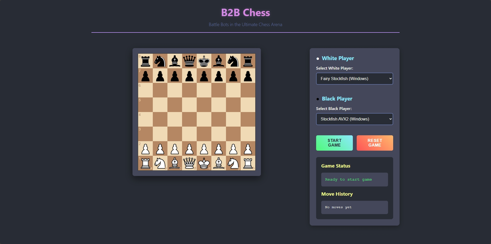

<h1 align="center">B2B-Chess: Local Bot-vs-Bot Chess with HTML and Node.js</h1>
<p align="center">This project allows you to watch two chess engines (UCI bots) play against each other locally, with a web-based graphical board.</p>

<br>



## Features

- Local engine-vs-engine chess (Stockfish, Fairy-Stockfish, etc.)
- Web-based graphical board using HTML, CSS, and JavaScript
- Real-time display of moves and game state in your browser
- Supports various UCI-compatible chess engines

## Prerequisites

- Node.js (LTS version recommended)
- npm (comes with Node.js)
- Two UCI-compatible chess engines (e.g., Stockfish, Fairy-Stockfish)

## Setup

### 1. Download chess engines

- Download Stockfish: https://stockfishchess.org/download/
- Download Fairy-Stockfish: https://github.com/ianfab/Fairy-Stockfish/releases
- Place the engine executables in the `bots/` folder (e.g., `bots/stockfish-windows-x86-64-avx2.exe`)

### 2. Install dependencies

```bash
npm install
```

### 3. Run the server

```bash
node server.js
```

### 4. Open in your browser

- After starting the server, open your web browser and navigate to `http://localhost:3000` (or the port indicated in the server output).

You will see a graphical chessboard, and the bots will start playing against each other.

## Playing Against an LLM

This project now includes an MCP client that allows you to play against a Large Language Model (LLM) such as a local Ollama instance or a model from OpenRouter.

### 1. Configure the LLM Provider

Create a `.env` file in the root of the project and add the following configuration:

**For Ollama:**
```
LLM_PROVIDER=ollama
OLLAMA_URL=http://localhost:11434
OLLAMA_MODEL=llama2
```

**For OpenRouter:**
```
LLM_PROVIDER=openrouter
OPENROUTER_API_KEY=your_openrouter_api_key
OPENROUTER_MODEL=google/gemini-flash-1.5
```

### 2. Start the MCP Client

Run one of the following commands to start the MCP client, depending on which color you want the LLM to play as. The client will automatically start the chess server.

**To play as White:**
```bash
npm run mcp:white
```

**To play as Black:**
```bash
npm run mcp:black
```

### 4. Start the Game

In your browser, select "Human" for the color you will play, and "MCP" for the color the LLM will play. Then, click "Start Game".

## Notes

- The `server.js` file handles the communication with the UCI engines and serves the web interface.
- The `mcp_client.js` file contains the logic for the MCP client and its interaction with the LLM.
- Chess piece images are located in `public/img/chesspieces/wikipedia/`.
- You can modify `server.js` to change engine paths, game rules, or other settings.
